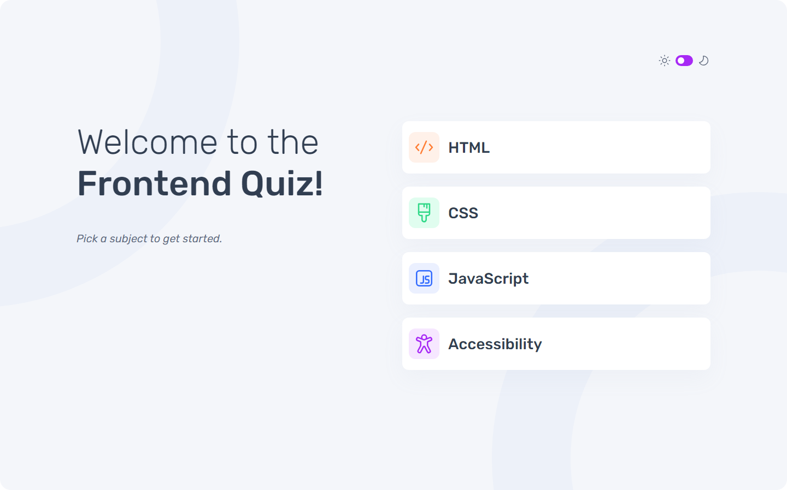
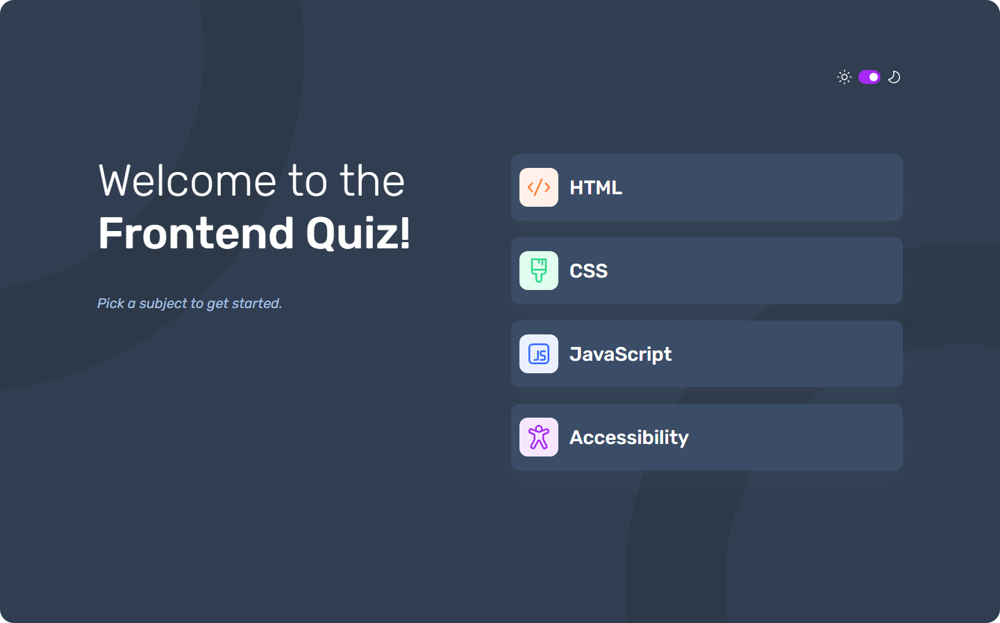

# Frontend Mentor - Frontend quiz app solution

This is a solution to the [Frontend quiz app challenge on Frontend Mentor](https://www.frontendmentor.io/challenges/frontend-quiz-app-BE7xkzXQnU). Frontend Mentor challenges help you improve your coding skills by building realistic projects. 

## Table of contents

- [Overview](#overview)
  - [The challenge](#the-challenge)
  - [Screenshot](#screenshot)
  - [Links](#links)
- [My process](#my-process)
  - [Built with](#built-with)
  - [What I learned](#what-i-learned)
  - [Continued development](#continued-development)
- [Author](#author)

## Overview

### The challenge

Users should be able to:

- Select a quiz subject
- Select a single answer from each question from a choice of four
- See an error message when trying to submit an answer without making a selection
- See if they have made a correct or incorrect choice when they submit an answer
- Move on to the next question after seeing the question result
- See a completed state with the score after the final question
- Play again to choose another subject
- View the optimal layout for the interface depending on their device's screen size
- See hover and focus states for all interactive elements on the page
- Navigate the entire app only using their keyboard
- **Bonus**: Change the app's theme between light and dark

### Screenshot

### Links

- Solution URL: [GitHub Repo](https://github.com/ryanbradley-webdev/frontend-quiz)
- Live Site URL: [Hosted on Netlify](https://frontend-quiz-rbwd.netlify.app/)

## My process

### Built with

- [Vue](https://vuejs.org/) - JS Framework
- [TypeScript](https://www.typescriptlang.org/) - Type Safety
- [Vite](https://vitejs.dev/) - Web bundling and scaffolding

### What I learned

This was my first project built with Vue and was a proof-of-concept in using Vue as a framework for my projects. I learned a ton about Vue's design patterns, the differences and similarities between Vue and React, as well as more advanced use-cases with integrating TypeScript.

### Continued development

Going forward I'm going to find more complex projects to build with Vue to get a better grasp on how this framework is used at larger scales. I also plan on implementing a backend to this app to practice incorporating API calls and async code into the Vue framework.

## Author

- Visit my portfolio - [ryanbradleyportfolio.com](https://ryanbradleyportfolio.com)
- Contact me for your next website - [ryanbradleywebdev.com](https://ryanbradleywebdev.com)
- Email me - [ryan@ryanbradleywebdev.com](ryan@ryanbradleywebdev.com)
- Follow my Instagram - [@ryanbradley_web_dev](https://www.instagram.com/ryanbradley_web_dev/)
